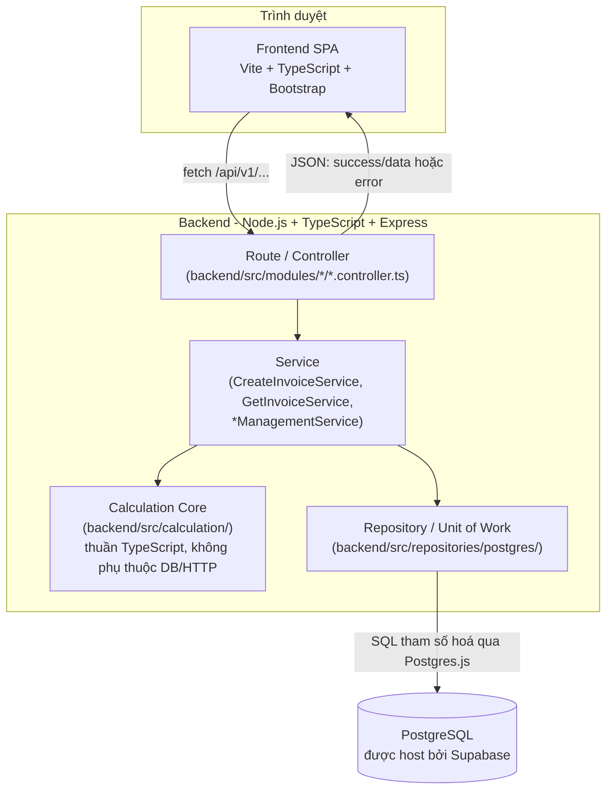
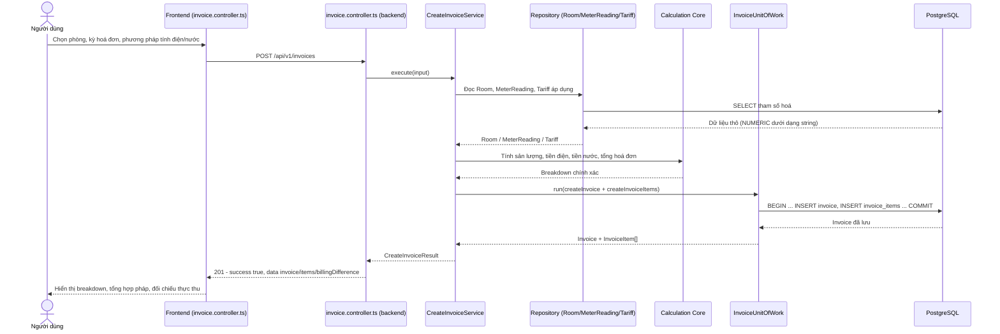
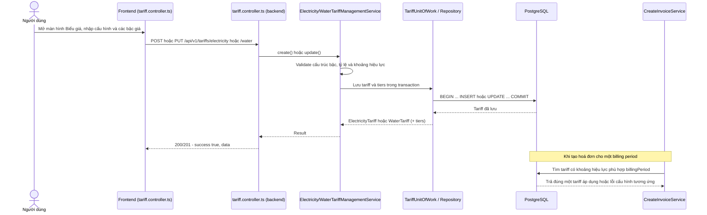
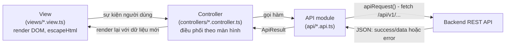

# OpenUtilityBill

[](https://github.com/QuocThinh271222007/OpenUtilityBill/actions/workflows/ci.yml)
[](LICENSE)
[](LICENSE)
[-brightgreen.svg)](docs/DEVELOPMENT.md)
[](https://www.typescriptlang.org/)
[](THIRD_PARTY_NOTICES.md)

Ứng dụng web mã nguồn mở giúp tính toán và đối chiếu chi phí điện/nước
cho nhà trọ một cách minh bạch.

## Giới thiệu

Người thuê trọ thường khó kiểm chứng cách hoá đơn điện/nước được tính
(phân bổ theo bậc, quy tắc định mức, thuế/phí và biểu giá áp dụng).
OpenUtilityBill hướng tới việc làm cho phép tính đó minh bạch, có thể
giải thích từng bước và kiểm tra lại độc lập:

- Tính chi phí điện và nước từ chỉ số công tơ và biểu giá đã cấu hình.
- Giải thích từng bước của phép tính hoá đơn, không chỉ đưa ra con số cuối cùng.
- Đối chiếu số tiền thực thu với chi phí được tính theo biểu giá và quy tắc cấu hình.

## Tính năng chính

- **Quản lý cơ sở/phòng**: tạo và sửa cơ sở cho thuê (`RentalProperty`)
  và từng phòng (`Room`), bao gồm số người ở hiện tại.
- **Ghi chỉ số công tơ**: nhập chỉ số điện/nước theo từng kỳ (tháng),
  hỗ trợ trường hợp công tơ tràn số (rollover) khi có giá trị tối đa.
- **Cấu hình biểu giá**: biểu giá điện dạng bậc thang với số bậc động
  cùng phương pháp fallback, và biểu giá nước với hai phương pháp tính
  (theo m³ hoặc theo số người).
- **Tạo và đọc lại hoá đơn**: tính hoá đơn theo Calculation Core, lưu
  breakdown chi tiết từng dòng, và đọc lại hoá đơn lịch sử mà không
  tính lại.
- **Đối chiếu thực thu — hợp pháp**: nhập số tiền thực tế đã thu và so
  sánh với tổng đã tính theo cấu hình hợp lệ.
- **Độ chính xác tài chính**: các giá trị tài chính/đo lường được xử lý
  dưới dạng chuỗi thập phân chính xác (`BigInt` ở Calculation Core,
  `NUMERIC`/`string` xuyên suốt database → API → frontend), không dùng
  floating-point cho phép tính tiền.

Xác thực, phân quyền theo vai trò, khu vực quản trị người dùng riêng và
triển khai production hiện chưa được cài đặt; xem mục **Ghi chú mở rộng
trong tương lai** ở cuối tài liệu.

## Kiến trúc hệ thống

- **Modular Monolith**: một backend triển khai duy nhất, được tổ chức
  nội bộ thành các module nghiệp vụ nhỏ (`property`, `room`,
  `meter-reading`, `tariff`, `invoice`).
- **Hướng MVC mở rộng**: Route → Controller → Service → Repository;
  Controller không chứa business logic hoặc SQL.
- **Calculation Core**: TypeScript thuần, độc lập với Express, HTML và
  Supabase; thực hiện phép tính sản lượng công tơ, tiền điện theo bậc/
  fallback, tiền nước và tổng hoá đơn.
- **Hợp đồng Result**: business logic trả về `{ success, data }` hoặc
  `{ success: false, error: { code, message } }`, giúp luồng lỗi rõ ràng
  và fail-fast.
- **Composition root theo module**: mỗi module nối Service thật với
  Repository thật trong `backend/src/composition/`.

Chi tiết: [`docs/ARCHITECTURE.md`](docs/ARCHITECTURE.md).

### Sơ đồ kiến trúc



## Luồng dữ liệu chính

### Luồng tạo hóa đơn



### Luồng quản lý biểu giá



### Luồng dữ liệu frontend



## Cấu trúc thư mục

```text
OpenUtilityBill/
  .github/workflows/   GitHub Actions CI
  backend/             REST API, Calculation Core, Repository, composition root
  frontend/            Vite + TypeScript + Bootstrap, controllers/views/api/utils
  database/            Migration, seed và SQL validation
  docs/                Tài liệu kiến trúc, API, database, frontend và vận hành
  CONTRIBUTING.md      Hướng dẫn đóng góp
  LICENSE              Giấy phép MIT
  README.md            Tổng quan dự án
```

## Công nghệ sử dụng

| Tầng | Công nghệ |
|---|---|
| Frontend | HTML5, TypeScript, Vite, Bootstrap |
| Backend | Node.js, TypeScript, Express |
| API | REST, JSON, versioned dưới `/api/v1` |
| Database | PostgreSQL, Supabase, Postgres.js, không ORM |
| CI | GitHub Actions (`.github/workflows/ci.yml`) |
| Quản lý mã nguồn | Git, Conventional Commits |

Xem [`THIRD_PARTY_NOTICES.md`](THIRD_PARTY_NOTICES.md) để biết package
bên thứ ba và giấy phép tương ứng.

## Bảng căn cứ pháp lý tham chiếu

Các quy tắc nghiệp vụ về điện trong OpenUtilityBill được tách khỏi mã
nguồn và lưu dưới dạng cấu hình để có thể cập nhật khi quy định thay
đổi. Bảng dưới đây tổng hợp các văn bản được nêu trong bộ tài liệu đầu
vào của dự án và cách chúng được phản ánh trong hệ thống.

| Văn bản | Hiệu lực / thời điểm áp dụng | Nội dung tham chiếu | Liên hệ trong OpenUtilityBill |
|---|---|---|---|
| **Quyết định số 1279/QĐ-BCT ngày 09/5/2025 của Bộ Công Thương** | Áp dụng từ **10/5/2025** | Giá bán lẻ điện sinh hoạt theo biểu giá bậc thang sáu bậc. | Biểu giá điện được mô hình hoá bằng `electricity_tariffs` và `electricity_tariff_tiers`; cấu hình mặc định gồm 6 bậc và có thể thay đổi mà không sửa Calculation Core. |
| **Thông tư số 60/2025/TT-BCT của Bộ Công Thương** | Hiệu lực từ **02/12/2025** | Quy định thực hiện giá bán điện đối với nhà cho thuê: định mức theo số người sử dụng điện; 4 người tương ứng 1 định mức, số người ít hơn được quy đổi theo tỷ lệ 1/4 định mức mỗi người; trường hợp không kê khai đầy đủ số người áp dụng giá bậc 3. | Calculation Core hỗ trợ phương pháp `QUOTA_TIERED`, hệ số định mức theo số người và phương án fallback theo bậc cấu hình; màn hình hoá đơn cho phép đối chiếu số tiền thực thu với số tiền tính theo cấu hình hợp lệ. |
| **Nghị định số 133/2026/NĐ-CP** | Hiệu lực từ **25/5/2026** | Căn cứ xử lý hành vi thu tiền điện cao hơn giá quy định và nghĩa vụ hoàn trả theo tài liệu tham chiếu. | Dự án dùng nội dung này làm bối cảnh cho chức năng đối chiếu thực thu; OpenUtilityBill **không** tự tính mức xử phạt hành chính. |
| **Nghị quyết số 204/2025/QH15** | Mức giảm thuế được tài liệu tham chiếu nêu áp dụng đến hết **31/12/2026** | Căn cứ cho mức giảm thuế giá trị gia tăng áp dụng trong giai đoạn tham chiếu. | Cấu hình mặc định sử dụng VAT điện **8%**; tỷ lệ VAT là dữ liệu cấu hình theo thời gian, không được hard-code vào Calculation Core. |

Đối với **nước sinh hoạt**, bộ tài liệu đầu vào nêu rõ giá nước do từng
địa phương ban hành nên có thể khác nhau giữa các tỉnh/thành. Vì vậy
OpenUtilityBill không coi một đơn giá nước duy nhất là mức pháp lý áp
dụng cho mọi nơi; giá theo m³, giá theo người, VAT và phí môi trường đều
được thiết kế dưới dạng tham số cấu hình.

> Bảng trên dùng để giải thích nguồn tham chiếu của các quy tắc và cấu
> hình trong phần mềm, không thay thế văn bản pháp luật gốc. Khi biểu giá,
> thuế hoặc quy định thay đổi, cần cập nhật cấu hình theo văn bản có hiệu
> lực tại thời điểm áp dụng.

## Hướng dẫn cài đặt & Chạy trên máy

### Yêu cầu

- Node.js 20 trở lên.
- npm.
- PostgreSQL/Supabase nếu muốn sử dụng các chức năng có truy cập dữ liệu.

### 1. Clone repository

```bash
git clone https://github.com/QuocThinh271222007/OpenUtilityBill.git
cd OpenUtilityBill
```

### 2. Cài đặt và chạy backend

```bash
cd backend
npm install
```

Backend đọc `DATABASE_URL` từ biến môi trường của tiến trình Node và
không tự động nạp file `.env`.

Windows PowerShell:

```powershell
$env:DATABASE_URL = '<SUPABASE_DATABASE_URL>'
npm run dev
```

Bash/Linux:

```bash
export DATABASE_URL='<SUPABASE_DATABASE_URL>'
npm run dev
```

Backend mặc định chạy tại:

```text
http://localhost:3000
```

Kiểm tra health endpoint:

```text
http://localhost:3000/api/v1/health
```

### 3. Cài đặt và chạy frontend

Mở terminal thứ hai tại thư mục repository:

```bash
cd frontend
npm install
npm run dev
```

Vite sẽ in URL local, thông thường:

```text
http://localhost:5173
```

Frontend dev server proxy các request `/api` sang backend tại
`http://localhost:3000`.

> Không commit `backend/.env`, `DATABASE_URL`, mật khẩu hoặc secret thật.

Hướng dẫn chi tiết hơn: [`docs/DEVELOPMENT.md`](docs/DEVELOPMENT.md).

## Hướng dẫn chạy kiểm thử tự động

Backend và frontend là hai package npm độc lập, vì vậy chạy kiểm tra ở
đúng thư mục tương ứng.

### Backend

```bash
cd backend
npm install
npm run typecheck
npm run build
npm test
```

`npm test` chạy test backend bằng `node:test` qua `tsx`.

- Nếu **không** đặt `DATABASE_URL`, các integration test cần PostgreSQL
  thật sẽ tự động `SKIP`; các test không phụ thuộc database vẫn chạy.
- Nếu `DATABASE_URL` trỏ tới database kiểm thử đã có migration/seed phù
  hợp, toàn bộ integration test cũng được thực thi.
- Không dùng database production cho thao tác kiểm thử có khả năng tạo
  dữ liệu tạm nếu chưa kiểm tra rõ phạm vi của test.

### Frontend

Frontend hiện không có Jest/Vitest. Kiểm tra tự động ở mức compile/build:

```bash
cd frontend
npm install
npm run typecheck
npm run build
```

### GitHub Actions CI

Workflow [`ci.yml`](.github/workflows/ci.yml) được kích hoạt khi `push`
hoặc mở/cập nhật `pull_request`. Workflow thực hiện:

```text
Backend  → npm ci → typecheck → build → test
Frontend → npm ci → typecheck → build
```

CI không sử dụng `DATABASE_URL` thật, vì vậy các integration test cần
PostgreSQL sẽ tự `SKIP` trong môi trường này.

## Đóng góp

OpenUtilityBill chào đón các đóng góp về sửa lỗi, tài liệu, kiểm thử,
UI/UX và mở rộng chức năng.

Trước khi bắt đầu, vui lòng đọc [`CONTRIBUTING.md`](CONTRIBUTING.md) để
nắm quy trình branch/commit/Pull Request, yêu cầu kiểm thử và các ranh
giới kiến trúc cần giữ.

Nếu phát hiện lỗi hoặc muốn đề xuất thay đổi lớn, hãy sử dụng
[GitHub Issues](https://github.com/QuocThinh271222007/OpenUtilityBill/issues).

## Kiểm thử / CI

- **Backend**: test runner là `node:test` qua `tsx`; các test tích hợp
  PostgreSQL tự `SKIP` nếu `DATABASE_URL` không tồn tại.
- **Frontend**: `npm run typecheck` và `npm run build` là các kiểm tra
  compile-time hiện có.
- **CI**: workflow chạy trên `push` và `pull_request`; CI không thay thế
  kiểm thử click-through thủ công qua trình duyệt.
- **Browser smoke**: checklist nằm tại
  [`docs/FINAL_SMOKE_CHECKLIST.md`](docs/FINAL_SMOKE_CHECKLIST.md) và cần
  được thực hiện thủ công trước khi phát hành.

## Tài liệu chi tiết

- [`docs/ARCHITECTURE.md`](docs/ARCHITECTURE.md) — kiến trúc và ranh giới module.
- [`docs/TECHNICAL_RATIONALE.md`](docs/TECHNICAL_RATIONALE.md) — cơ sở lựa chọn kỹ thuật.
- [`docs/ERROR_HANDLING.md`](docs/ERROR_HANDLING.md) — hợp đồng lỗi và fail-fast.
- [`docs/DEVELOPMENT.md`](docs/DEVELOPMENT.md) — hướng dẫn phát triển chi tiết.
- [`docs/FRONTEND.md`](docs/FRONTEND.md) — kiến trúc frontend.
- [`docs/DOMAIN_MODEL.md`](docs/DOMAIN_MODEL.md) — mô hình domain.
- [`docs/DATABASE_DESIGN.md`](docs/DATABASE_DESIGN.md) — thiết kế schema.
- [`docs/TRANSACTIONS.md`](docs/TRANSACTIONS.md) — transaction và ACID.
- [`docs/CALCULATION_CORE.md`](docs/CALCULATION_CORE.md) — pipeline tính toán.
- [`docs/NUMERIC_PRECISION.md`](docs/NUMERIC_PRECISION.md) — độ chính xác số học.
- [`docs/DATABASE_ACCESS.md`](docs/DATABASE_ACCESS.md) — Postgres.js và Repository.
- [`docs/CREATE_INVOICE_WORKFLOW.md`](docs/CREATE_INVOICE_WORKFLOW.md) — workflow hoá đơn.
- [`docs/API.md`](docs/API.md) — hợp đồng REST hoá đơn.
- [`docs/MANAGEMENT_API.md`](docs/MANAGEMENT_API.md) — API quản lý.
- [`database/README.md`](database/README.md) — migration/seed/validation.
- [`docs/FINAL_SMOKE_CHECKLIST.md`](docs/FINAL_SMOKE_CHECKLIST.md) — browser smoke checklist.

## Giấy phép

MIT — xem [`LICENSE`](LICENSE). Các file mã nguồn giữ header
`SPDX-License-Identifier: MIT` theo quy ước hiện tại của repository.

## Ghi chú mở rộng trong tương lai

Các hạng mục sau hiện chưa được cài đặt:

- Xác thực và phân quyền theo vai trò.
- Khu vực quản trị/người dùng có kiểm soát quyền riêng biệt.
- Endpoint `DELETE` cho các tài nguyên có ràng buộc lịch sử.
- Triển khai production và continuous deployment (CD) tự động.
- Biểu đồ và số liệu phân tích tổng hợp.