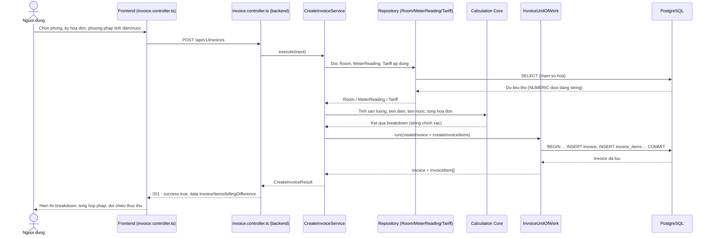
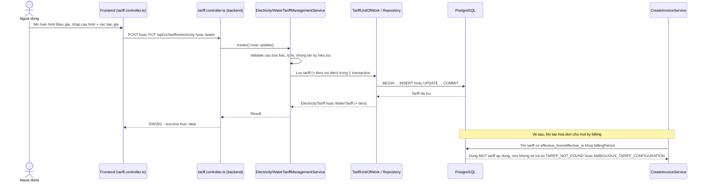
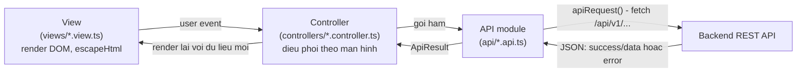

# OpenUtilityBill

[](https://github.com/QuocThinh271222007/OpenUtilityBill/actions/workflows/ci.yml)
[](LICENSE)
[](LICENSE)
[](docs/DEVELOPMENT.md)
[](https://www.typescriptlang.org/)
[](THIRD_PARTY_NOTICES.md)

Ứng dụng web mã nguồn mở giúp tính toán và so sánh chi phí điện/nước
cho nhà trọ một cách minh bạch.

## Giới thiệu

Người thuê trọ thường không thể kiểm chứng cách hoá đơn điện/nước của
mình được tính ra (phân bổ theo bậc, quy tắc định mức, thuế/phí do chủ
trọ áp dụng). OpenUtilityBill hướng tới việc làm cho phép tính đó minh
bạch, có thể giải thích từng bước, và kiểm tra lại độc lập:

- Tính chi phí điện và nước từ chỉ số công tơ và biểu giá đã công bố.
- Giải thích từng bước của phép tính hoá đơn, không chỉ đưa ra con số
  cuối cùng.
- Cho phép so sánh giữa các kỳ hoá đơn hoặc các kịch bản biểu giá khác
  nhau.

## Tính năng chính

- **Quản lý cơ sở/phòng**: tạo và sửa cơ sở cho thuê (`RentalProperty`)
  và từng phòng (`Room`), bao gồm số người ở hiện tại.
- **Ghi chỉ số công tơ**: nhập chỉ số điện/nước theo từng kỳ (tháng),
  hỗ trợ trường hợp công tơ tràn số (rollover) khi có giá trị tối đa.
- **Cấu hình biểu giá**: biểu giá điện dạng bậc thang với số bậc động
  (không cố định 6 bậc) cùng phương pháp fallback, và biểu giá nước với
  hai phương pháp tính (theo m³ hoặc theo số người).
- **Tạo và đọc lại hoá đơn**: tính hoá đơn theo Calculation Core, lưu
  breakdown chi tiết từng dòng, và đọc lại một hoá đơn lịch sử mà
  KHÔNG tính lại (đảm bảo tính ổn định lịch sử khi tariff/số người ở
  thay đổi sau đó).
- **Đối chiếu thực thu — hợp pháp**: nhập số tiền thực tế đã thu và so
  sánh với tổng đã tính hợp pháp.
- **Độ chính xác tuyệt đối**: mọi giá trị tài chính/đo lường được xử
  lý dưới dạng chuỗi thập phân chính xác (`BigInt` ở Calculation Core,
  `NUMERIC`/`string` xuyên suốt database → API → frontend) — không bao
  giờ dùng số dấu phẩy động cho tiền.

Xác thực, phân quyền theo vai trò, khu vực quản trị người dùng riêng,
và triển khai production **chưa được cài đặt** — xem mục "Ghi chú mở
rộng trong tương lai" ở cuối tài liệu này.

## Kiến trúc hệ thống

- **Modular Monolith**: một backend triển khai duy nhất, được tổ chức
  nội bộ thành các module nghiệp vụ nhỏ (`property`, `room`,
  `meter-reading`, `tariff`, `invoice`).
- **Hướng MVC mở rộng**: Route → Controller → Service → Repository,
  không có business logic hay SQL nào trong Controller.
- **Calculation Core**: TypeScript thuần, độc lập với Express, HTML, và
  Supabase — thực hiện phép tính sản lượng công tơ, tiền điện theo bậc/
  fallback, tiền nước, và tổng hoá đơn, đã cài đặt và unit-test độc lập
  (xem [`docs/CALCULATION_CORE.md`](docs/CALCULATION_CORE.md)).
- **Hợp đồng Result**: business logic trả về `{ success, data }` hoặc
  `{ success: false, error: { code, message } }` thay vì throw hay trả
  `false`, giúp lỗi được lan truyền theo kiểu fail-fast.
- **Composition root theo module**: mỗi module tự nối Service thật với
  Repository thật (`backend/src/composition/`), lazy — `GET /api/v1/health`
  vẫn hoạt động dù chưa cấu hình `DATABASE_URL`.

Chi tiết đầy đủ: [`docs/ARCHITECTURE.md`](docs/ARCHITECTURE.md).

### Sơ đồ kiến trúc


## Luồng dữ liệu chính

### Luồng tạo hóa đơn



### Luồng quản lý biểu giá



### Luồng dữ liệu frontend



## Cấu trúc thư mục

```
OpenUtilityBill/
  .github/workflows/   CI (typecheck/build/test backend + frontend)
  backend/     REST API Node.js + TypeScript + Express, domain model,
               Calculation Core (backend/src/calculation/), adapter
               database (backend/src/database/), tầng Repository
               (backend/src/repositories/), và composition root nối
               Service thật với Repository thật
               (backend/src/composition/)
  frontend/    Client Vite + TypeScript + Bootstrap — api/ (gọi REST),
               types/ (mirror hợp đồng dữ liệu), utils/ (hàm hiển thị/
               độ chính xác thuần), controllers/ (điều phối theo từng
               màn hình), views/ (render DOM), và một router hash nhỏ
               tự viết (frontend/src/controllers/
               navigation.controller.ts)
  database/    Schema PostgreSQL (migrations/), dữ liệu seed (seeds/),
               và SQL kiểm chứng runtime (validation/)
  docs/        Tài liệu kiến trúc, domain model, truy cập database,
               tính toán, API/API quản lý, và cơ sở lựa chọn kỹ thuật
```

## Công nghệ sử dụng

| Tầng | Công nghệ |
|---|---|
| Frontend | HTML5, TypeScript, Vite, Bootstrap (chỉ CSS) |
| Backend | Node.js, TypeScript, Express |
| API | REST, JSON, versioned dưới `/api/v1` |
| Database | PostgreSQL, host bởi Supabase (SQL trực tiếp qua Postgres.js, không ORM) |
| CI | GitHub Actions (`.github/workflows/ci.yml`) |
| Quản lý mã nguồn | Git, Conventional Commits |

Xem [`THIRD_PARTY_NOTICES.md`](THIRD_PARTY_NOTICES.md) để biết chính
xác các package bên thứ ba đang dùng và giấy phép của chúng.

## Cách chạy dự án

Xem [`docs/DEVELOPMENT.md`](docs/DEVELOPMENT.md) để biết lệnh cài đặt,
chạy, build, và typecheck cho cả `backend/` và `frontend/`.

## Kiểm thử / CI

- **Backend**: `npm test` chạy test runner có sẵn của Node
  (`node:test`, qua `tsx`) — bao phủ Calculation Core, adapter
  database, ánh xạ lỗi Repository, orchestration Service (Repository
  giả), và tầng HTTP của mỗi module. Các test cần PostgreSQL thật
  (`*.integration.test.ts`) tự động **SKIP** (không FAIL) khi
  `DATABASE_URL` chưa được đặt.
- **Frontend**: không có test runner riêng (không dùng Jest/Vitest) —
  `npm run typecheck` (`tsc --noEmit`) và `npm run build` là bước kiểm
  tra đúng đắn tại compile-time.
- **CI**: mỗi `push`/`pull_request` chạy GitHub Actions
  (`.github/workflows/ci.yml`) — typecheck + build + test cho backend,
  typecheck + build cho frontend. CI **không** kết nối tới một
  PostgreSQL/Supabase thật; các test tích hợp database tự skip trong
  môi trường CI đúng như khi chạy local không có `DATABASE_URL`.
- **Kiểm thử click-through thủ công qua trình duyệt**: đã có checklist
  ([`docs/FINAL_SMOKE_CHECKLIST.md`](docs/FINAL_SMOKE_CHECKLIST.md))
  nhưng việc thực hiện thủ công trên trình duyệt vẫn cần được chủ dự
  án xác nhận độc lập trước khi phát hành — CI không thay thế bước
  này.

## Tài liệu chi tiết

- [`docs/ARCHITECTURE.md`](docs/ARCHITECTURE.md) — kiến trúc, luồng
  request, hướng phụ thuộc, ranh giới module.
- [`docs/TECHNICAL_RATIONALE.md`](docs/TECHNICAL_RATIONALE.md) — cơ sở
  lựa chọn kỹ thuật và kiến trúc cho từng công nghệ trong dự án.
- [`docs/ERROR_HANDLING.md`](docs/ERROR_HANDLING.md) — hợp đồng thành
  công/thất bại, mã lỗi, pipeline fail-fast.
- [`docs/DEVELOPMENT.md`](docs/DEVELOPMENT.md) — cài đặt và các lệnh.
- [`docs/FRONTEND.md`](docs/FRONTEND.md) — kiến trúc frontend, sơ đồ
  màn hình/điều hướng, ranh giới API-client, quy tắc chuỗi tài chính,
  chuyển đổi month↔billingPeriod, và trạng thái kiểm chứng hiện tại.
- [`docs/DOMAIN_MODEL.md`](docs/DOMAIN_MODEL.md) — các thực thể nghiệp
  vụ, quan hệ giữa chúng, và nguyên tắc snapshot lịch sử.
- [`docs/DATABASE_DESIGN.md`](docs/DATABASE_DESIGN.md) — lý do thiết kế
  schema: chuẩn hoá, khoá, ràng buộc, `NUMERIC` so với `FLOAT`.
- [`docs/TRANSACTIONS.md`](docs/TRANSACTIONS.md) — đảm bảo ACID và
  ranh giới transaction cho các luồng ghi.
- [`docs/CALCULATION_CORE.md`](docs/CALCULATION_CORE.md) — pipeline
  tính toán hoá đơn, trách nhiệm từng module, thiết kế fail-fast.
- [`docs/NUMERIC_PRECISION.md`](docs/NUMERIC_PRECISION.md) — vì sao
  dùng số học phân số chính xác dựa trên `BigInt` thay vì dấu phẩy
  động.
- [`docs/DATABASE_ACCESS.md`](docs/DATABASE_ACCESS.md) — Postgres.js,
  ranh giới Repository, query tham số hoá, transaction, và ranh giới độ
  chính xác `NUMERIC`/`BIGINT` tại adapter database.
- [`docs/CREATE_INVOICE_WORKFLOW.md`](docs/CREATE_INVOICE_WORKFLOW.md)
  — trình tự `CreateInvoiceService`/`GetInvoiceService`: đọc dữ liệu,
  tính toán, ghi transactional, chống trùng lặp/race condition, nguyên
  tắc snapshot hoá đơn, đọc lại dữ liệu đã lưu.
- [`docs/API.md`](docs/API.md) — hợp đồng REST cho
  `POST`/`GET /api/v1/invoices`: hình dạng request/response, định dạng
  ngày `YYYY-MM-DD`, hợp đồng chuỗi thập phân tài chính, ánh xạ HTTP
  status, và composition database lazy.
- [`docs/MANAGEMENT_API.md`](docs/MANAGEMENT_API.md) — hợp đồng REST
  cho quản lý property/room/meter-reading/tariff: hợp đồng số/ngày theo
  từng tài nguyên, chống trùng lặp/chồng lấn, bảo vệ tham chiếu lịch sử
  (vì sao một meter reading hay tariff đã được tham chiếu không thể
  sửa), và vì sao chưa cài đặt DELETE.
- [`database/README.md`](database/README.md) — các file schema/seed và
  cách chạy chúng.
- [`docs/FINAL_SMOKE_CHECKLIST.md`](docs/FINAL_SMOKE_CHECKLIST.md) —
  checklist smoke test thủ công trên trình duyệt, cần thực hiện trước
  khi phát hành.

## Giấy phép

MIT — xem [`LICENSE`](LICENSE). Mọi file mã nguồn mang header
`SPDX-License-Identifier: MIT`.

## Ghi chú mở rộng trong tương lai

Các hạng mục sau đây **chưa được cài đặt**, là các quyết định sản phẩm
độc lập cần được xem xét riêng, không nằm trong phạm vi hiện tại:

- Xác thực (authentication) và phân quyền theo vai trò.
- Khu vực quản trị/người dùng có kiểm soát quyền riêng biệt.
- Endpoint xoá (DELETE) cho bất kỳ tài nguyên nào — khoá ngoại
  `RESTRICT` lịch sử khiến ngữ nghĩa xoá cần được thiết kế cẩn thận,
  không phải một thiếu sót.
- Triển khai lên môi trường production và continuous deployment (CD)
  tự động — CI hiện tại chỉ kiểm tra typecheck/build/test, không build
  image hay deploy.
- Biểu đồ/số liệu phân tích (analytics/dashboard tổng hợp).
